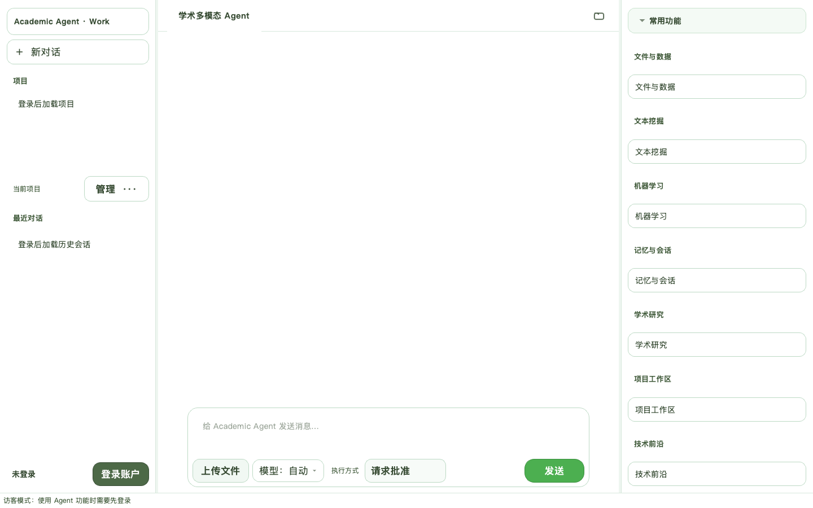
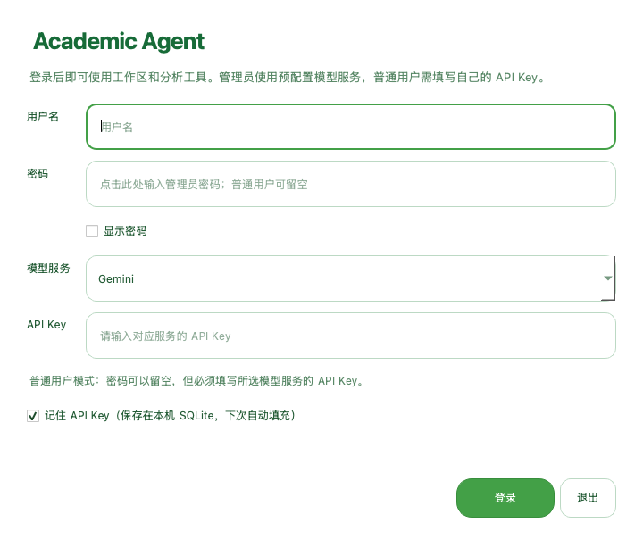
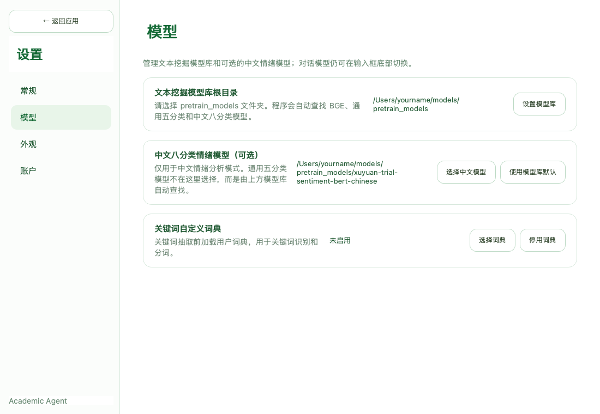
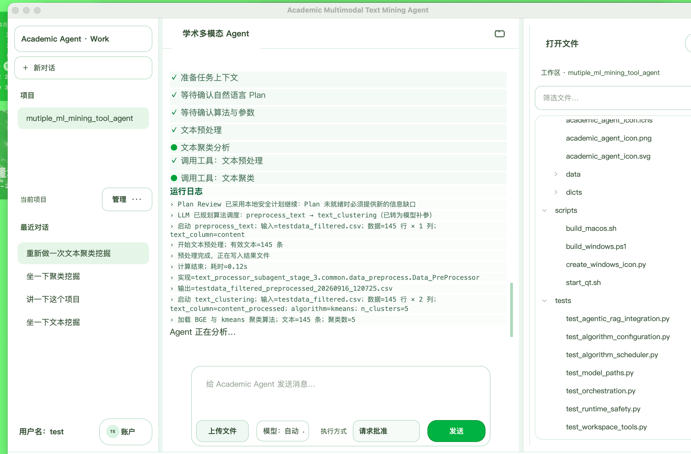
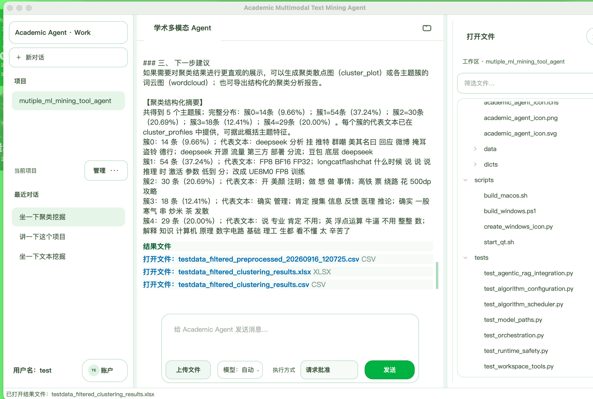
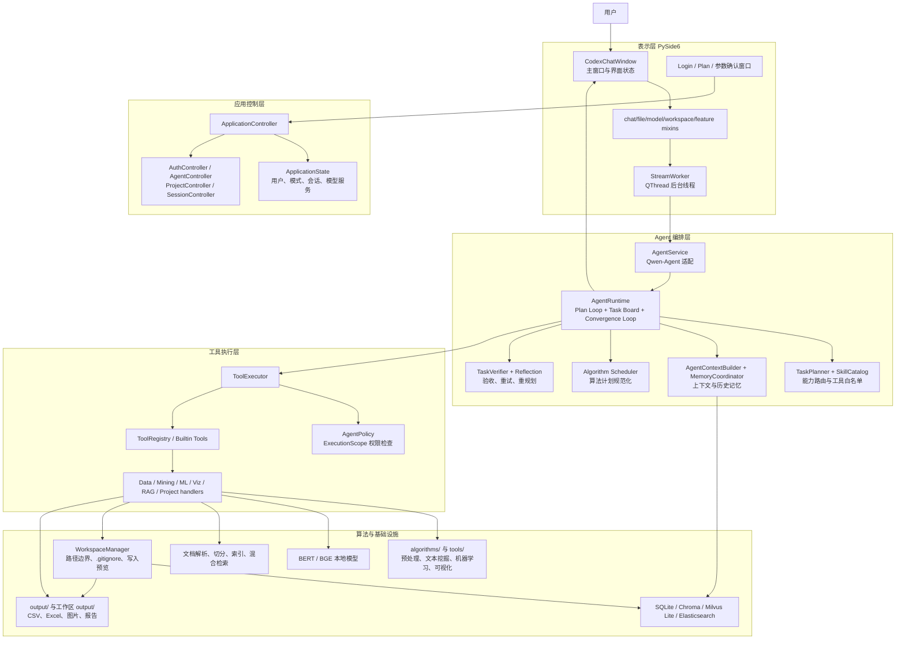
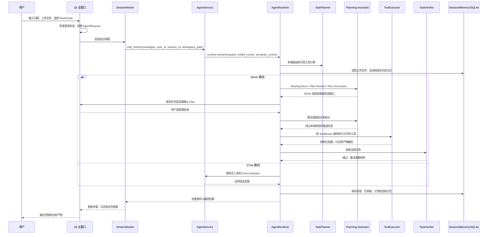

# Academic Agent

Academic Agent 是一个基于 PySide6 的桌面 Agent 应用，面向文本挖掘、机器学习、数据分析、可视化、文档问答和项目工作区操作。

项目的核心原则是：大模型负责理解需求、规划步骤和解释结果；程序负责参数校验、工具权限、算法计算、任务状态和文件操作确认。

> 重要：本项目当前是桌面应用，不是已经部署好的 Web API 服务。用户下载代码后，需要在本机安装依赖、配置大模型服务和本地算法模型，再启动 Qt 客户端。

面向最终用户的完整操作流程请阅读：[用户使用文档](USER_GUIDE.md)，其中包含首次登录、普通用户“注册”说明、云端模型配置、Ollama、本地 BERT/BGE 模型目录和常见问题。

## 文档导航

- [项目架构](#项目架构)：分层结构、模块职责和依赖方向
- [核心运行流程](#核心运行流程)：从启动、登录、输入问题到结果回传
- [典型任务流程](#典型任务流程)：文本聚类、情感分析、机器学习、项目代码和文档 RAG
- [Work 与 Chat 的实现差异](#work-与-chat-的实现差异)：两种模式的权限和执行边界
- [用户使用文档](USER_GUIDE.md)：注册登录、模型配置和面向最终用户的操作步骤

## 界面预览

### 主界面



### 登录窗口



### 本地模型配置



### 文本聚类执行过程



### 文本聚类结果与输出文件



以上截图由项目当前 PySide6 界面实际启动并渲染，后两张为项目实际运行过程截图，不是静态示意图。

## 功能概览

| 模块 | 能力 |
| --- | --- |
| 数据分析 | CSV、Excel、JSON、文本文件加载，数据概览、统计分析、缺失值和重复值处理 |
| 文本挖掘 | 文本预处理、文本聚类、情感分析、关键词提取、实体识别、关系抽取 |
| 机器学习 | 回归、分类、因果推断、特征处理和结果指标生成 |
| 可视化 | 词云、聚类分布图、情感分布图、折线图等 |
| 文档问答 | PDF、Markdown、TXT、DOCX、CSV、JSON 文档解析、混合检索和引用证据 |
| 工作区 | 检索、读取、生成、编辑和删除项目文件；写入类操作支持预览和确认 |
| Agent 编排 | Routing → Plan → Task Board → 执行 → 验收 → 重试/重规划 → 结果汇总 |
| 模型服务 | Gemini、通义千问（新加坡/北京）和 Ollama；可在客户端切换 |

## 项目架构

### 设计定位

Academic Agent 不是把所有事情交给大模型的聊天机器人，而是一个由程序控制执行边界、由模型辅助理解和规划的本地桌面 Agent。系统把“理解需求”和“执行动作”拆开：

| 责任方 | 负责内容 | 不负责内容 |
| --- | --- | --- |
| 大模型 | 理解自然语言、判断当前关注点、生成 Plan、补充解释、选择候选算法 | 不直接决定工具权限、不绕过用户确认、不替用户猜缺失字段 |
| 本地 Planner / Runtime | 路由、Plan 生命周期、任务顺序、状态转换、重试、重规划和终止 | 不替代具体算法计算 |
| Algorithm Scheduler | 根据当前允许的工具提出算法顺序和参数 | 不执行未授权工具，不把工作区写入工具纳入算法调度 |
| Tool Executor / Policy | 检查工具是否注册、当前任务是否允许、参数和路径是否安全 | 不依赖系统提示词作为唯一安全边界 |
| 数据与算法模块 | 加载数据、预处理、BERT/BGE 推理、机器学习计算、图表和文件产物 | 不负责解释用户意图 |
| Qt 界面 | 登录、上传、确认 Plan、显示进度、展示结果和文件 | 不在主线程执行耗时模型或算法计算 |

因此，模型输出即使格式错误、提出了不存在的工具或缺少字段，程序仍会经过本地校验和安全兜底；模型不能单独扩大当前任务的能力范围。

### 总体分层



### 目录与模块职责

```text
qt_client.py                         # Qt 启动入口、缓存目录、单实例锁
academic_agent/
├── views/                            # PySide6 表示层
│   ├── main_window.py                # 主窗口、登录、项目和 Agent 生命周期
│   ├── main_layout.py                # 左侧项目、中间对话、底部输入框、右侧文件区
│   ├── chat_mixin.py                 # 发送消息、上传文件、进度事件、结果渲染
│   ├── workers.py                    # StreamWorker，避免阻塞 Qt 主线程
│   ├── auth.py                       # 登录窗口和 API Key 输入
│   ├── dialogs.py                    # Plan、算法参数、依赖和确认窗口
│   ├── model_mixin.py                # BERT/BGE 模型目录选择和检查
│   └── settings_window.py            # 模型、账户、权限、存储和外观设置
├── controllers/                      # 应用用例和生命周期
│   ├── application.py                # 组合各 Controller
│   ├── auth.py                       # 本地认证、.env 和模型凭据应用
│   ├── agent.py                      # Agent 初始化、重置和模型服务切换
│   ├── projects.py                   # 项目注册、切换和删除
│   └── sessions.py                   # 会话列表、加载和删除
├── models/                           # 与 Qt 无关的应用状态和数据模型
├── agent/                            # Agent 核心
│   ├── adapters/qwen.py              # Qwen-Agent、Gemini 和工具包装器
│   ├── runtime.py                    # 全部运行时编排逻辑
│   ├── planning/planner.py           # 本地能力路由
│   ├── planning/algorithm_scheduler.py # 算法计划白名单与参数校验
│   ├── orchestration/                # Plan Loop 和 TaskVerifier
│   ├── tooling/                      # 工具注册、执行器和业务 handler
│   ├── policies/                     # 工具访问策略
│   ├── context.py                    # 文件、记忆、Plan 和用户确认信息组装
│   ├── session.py                    # 当前会话上传文件、任务和产物
│   └── memory/                       # 短期、长期和语义记忆协调
├── tools/                            # 稳定的业务工具接口和算法适配
├── algorithms/                       # 预处理、文本挖掘、机器学习和可视化实现
├── rag/                              # 文档解析、索引、检索和表格分析
├── integrations/                     # 外部文本算法源项目适配器
├── infrastructure/                   # 路径、模型、权限、存储和产物策略
└── repositories/                     # SQLite 会话和项目仓储
```

模块之间的依赖方向是：

```text
views → controllers → agent runtime → tool registry/handlers
                                      → tools/algorithms/rag/infrastructure
repositories/infrastructure ← controllers/agent runtime
```

`views` 不应该直接调用具体算法；具体算法也不应该依赖 Qt 控件。这样同一套 Planner、Runtime、ToolExecutor 和安全策略可以被测试或其他客户端复用。

## 核心运行流程

### 1. 启动与初始化流程

`python qt_client.py` 启动后依次完成：

1. `configure_numeric_runtime()` 设置 NumPy、PyTorch 等数值运行时的线程和安全选项。
2. 设置 macOS Qt 图层、Matplotlib 和 XDG 可写缓存目录。
3. 读取 Qt `QSettings` 中已经保存的本地模型路径和存储设置。
4. 创建统一的 `output/` 和用户可写运行时目录。
5. 创建系统临时目录中的单实例锁，避免重复打开多个客户端进程。
6. 以访客状态显示主窗口；真正使用 Agent、数据和项目工具时再要求登录。
7. 登录成功后，`AuthController` 应用模型服务凭据，`AgentController` 初始化 `AgentService`。
8. 通过 `StreamWorker` 在后台线程运行后续模型和算法任务，Qt 主线程只负责界面响应。

### 2. 用户输入到 Agent 的流程



### 3. `AgentRequest` 是一次任务的边界

一次请求由 `academic_agent.agent.types.AgentRequest` 描述，核心字段包括：

| 字段 | 含义 |
| --- | --- |
| `messages` | 当前会话消息列表，最后一条用户消息是本轮问题 |
| `user_id` | 当前本地用户，用于隔离会话和记忆 |
| `session_id` | 当前对话 ID，用于保存上传文件、任务板和产物 |
| `workspace_path` | Work 模式当前项目工作区路径；Chat 模式为空 |
| `chat_only` | 是否只允许自然语言对话 |

上传文件通过 `SessionContext.uploaded_files` 和 `schema` 进入上下文。上传文件是用户明确授权的分析输入，即使它位于工作区之外也可以被读取；但它不会因此变成可任意修改的项目文件。

### 4. 路由与能力白名单

`TaskPlanner` 先根据用户问题选择一个主路由，并从 `SkillCatalog` 生成当前路由允许的工具集合：

| 路由 | 典型问题 | 主要工具范围 |
| --- | --- | --- |
| `chat` | 解释概念、讨论思路 | 不注册任何工具 |
| `document` | 阅读 PDF、Markdown、DOCX 并带引用回答 | `document_rag` |
| `data` | 数据概览、统计、预处理、文本挖掘 | `profile_data`、`load_data`、`data_statistics`、`text_clustering` 等 |
| `machine_learning` | 回归、分类、因果推断 | `data_preprocess`、`feature_processing`、`regression` 等 |
| `visualization` | 词云、聚类图、情感图、折线图 | `wordcloud`、`cluster_plot`、`sentiment_plot`、`line_chart` |
| `project` | 查找、读取、生成、编辑项目代码 | `list_project_files`、`read_project_file`、`write_project_file` 等 |

路由先由本地规则保证基本能力边界，再由语义规划模型补充本轮重点。模型可以说明“为什么做”，但不能通过自然语言输出把未授权工具加入 `available_tools`。

对于 Work 模式中的“帮我分析一下”等模糊请求，Runtime 会先询问“文本挖掘、机器学习、数据分析或学术文献”等方向，再继续规划；不会把一个没有目标的请求直接变成无限范围的任务。

### 5. Plan Loop：补齐信息并生成可审阅计划

当请求进入 Work 模式后，`AgentRuntime._plan_loop()` 会让没有工具权限的 Planning Assistant 判断信息是否足够：

1. 读取当前用户问题、路由、可用工具、上传文件结构和已经确认的信息。
2. 如果缺少会改变执行方向的字段，返回一个信息缺口，例如文本列、目标变量、特征列或处理变量。
3. 界面把缺口渲染成选项，用户选择后写入 `confirmed_information`。
4. 最多逐轮补充必要信息，避免重复询问已经确认的内容。
5. 信息完整后生成自然语言 Plan，说明目标、产物、执行顺序、边界和完成标准。
6. 用户在界面中选择批准或取消；取消则本次任务不执行。

Plan 是“怎么做”的计划书，不是最终分析报告。Plan 生成阶段不调用数据、文件或项目工具，避免规划过程产生副作用。

### 6. 算法调度：模型提出，程序校验并执行

对数据、文本和机器学习任务，`algorithm_scheduler.py` 会把当前 `available_tools` 中的确定性算法描述给 Planning Assistant。模型可以提出：

- 工具顺序，例如 `data_preprocess → feature_processing → regression`；
- 算法，例如 `xgboost`、`kmeans` 或 `dbscan`；
- 参数，例如 `text_column`、`target_var`、`feature_vars`、`n_clusters`。

之后由 `normalize_algorithm_schedule()` 本地规范化：

1. 只接受已经注册且属于 `SCHEDULABLE_TOOLS` 的工具。
2. 每个调度任务只对应一个工具。
3. 检查必需参数是否存在；缺少的字段交给后续模型补充，不由程序猜列名。
4. 用户在参数窗口确认的算法和参数优先，模型不能偷偷替换。
5. 工作区写入、编辑和删除工具不进入算法调度集合。
6. 默认最多处理 12 个调度任务；Task Board 另有最多 50 个任务的安全限制。
7. 如果模型输出格式不符合约定，保留本地安全兜底路径，不伪造用户没有提供的参数。

调度结果写入 `AgentPlan.algorithm_schedule`，但它仍然不是权限。真正执行时，Runtime 还会把任务绑定到当前 `ExecutionScope.allowed_tools`，再次由 `ToolExecutor` 和 `AgentPolicy` 检查。

### 7. Task Board：把计划变成可观察状态

`TaskBoard` 保存任务状态和依赖关系，每个 `TaskItem` 包含：

- 任务 ID、标题和目标；
- `suggested_tools`、`scheduled_tool` 和已规范化参数；
- 依赖任务；
- 交付物和 `done_when` 完成标准；
- 当前状态、尝试次数、反馈、证据和产物路径。

任务状态通常按以下顺序变化：

```text
READY → RUNNING → VERIFYING → COMPLETED
                         ├──→ READY       （仍有重试次数）
                         └──→ BLOCKED     （达到尝试上限）

READY → WAITING_USER      （等待信息、Plan 或算法参数）
```

Task Board 只让没有未完成依赖的任务进入执行。界面收到 `task_started`、`tool_started`、`task_checked`、`task_completed` 等事件后，实时更新中间区域的执行步骤和运行日志。

### 8. ToolExecutor：所有工具调用的统一闸门

所有内置工具先在 `academic_agent/agent/tooling/builtins.py` 注册为 `ToolSpec`，再由 `ToolExecutor.execute()` 统一执行：

```text
模型或 Runtime 请求工具
        ↓
ToolRegistry 查找 ToolSpec
        ↓
ExecutionScope.allowed_tools 检查
        ↓
AgentPolicy 参数、模式和路径检查
        ↓
业务 handler 调用 tools/、algorithms/ 或 rag/
        ↓
记录 tool_started / tool_finished / tool_failed / tool_denied
        ↓
返回结构化结果给 Runtime 和当前任务
```

工具调用的结果通常包含 `success`、`error`、摘要字段、指标和 `artifacts`。Runtime 会把这些观察结果放入当前任务上下文，让后续模型只处理 `current_task`，避免一次性扩展到其他任务。

### 9. 验收、重试和重规划

一个工具返回成功并不等于整个任务已经完成。当前任务会经过 `TaskVerifier`：

1. 检查结果是否满足任务自己的 `done_when`。
2. 优先使用结构化工具观察结果，例如行数、指标、聚类分布和产物路径。
3. 通过则标记 `COMPLETED`，记录证据和产物。
4. 未通过且仍有尝试次数时，将任务放回 `READY` 并携带反馈重试。
5. 达到尝试上限后标记 `BLOCKED`。
6. Reflection 判断是否需要新增后续任务或重新生成 Plan。
7. 当前运行最多进入一次有限重规划；重规划仍然需要重新经过 Plan Review、参数确认和算法调度。

文本聚类和情感分析的结果修复任务有单独路径：如果已有结构化标签和分布足够，程序可以调用 `repair_text_clustering` 或 `repair_sentiment_analysis` 重建结果，不必再次调用 BGE/BERT。

### 10. 结果、记忆和界面回传

任务结束后，Runtime 会：

1. 汇总已完成任务的结果；
2. 对阻塞任务说明原因和已完成部分；
3. 追加关键结构化观察，避免长文本回答截断后丢失聚类分布等核心信息；
4. 把产物路径写入当前 `SessionContext.artifacts`；
5. 通过 `StreamWorker` 把结果和进度事件回传给 Qt；
6. 将用户问题、助手回答、计划轨迹和任务板写入会话/记忆存储。

## 典型任务流程

### 文本聚类

```text
上传 CSV/Excel
  → profile_data / load_data
  → 确认文本列，例如 content
  → preprocess_text
  → 外部源项目加载 BGE 向量模型
  → 生成文本向量
  → KMeans / Agglomerative / DBSCAN 聚类
  → 生成 cluster_label、cluster_distribution、cluster_profiles
  → 输出 CSV/Excel，必要时生成 cluster_plot
  → TaskVerifier 检查每个主题簇是否都有结果
  → UI 展示过程、摘要和结果文件
```

文本聚类依赖 `bge-cn`，但 BGE 只负责向量表示，聚类算法本身由本地安全适配层执行。聚类失败时，Runtime 可以依据结构化结果走修复路径，而不是让模型凭空补写缺失主题。

### 情感/情绪分析

```text
上传文本文件
  → 确认文本列和分析模式
  → preprocess_text
  → 选择 general 五分类模型或 chinese 八分类 BERT
  → 输出每条文本的标签和置信信息
  → 可选 sentiment_plot
  → 验收标签数量、产物路径和结果完整性
```

### 回归或分类

```text
读取数据状态
  → 确认 target_var 和 feature_vars
  → 用户确认算法和参数，或由算法调度器提出候选
  → data_preprocess
  → feature_processing（填充、编码、标准化）
  → regression / classification
  → 输出 R2/RMSE/MAE 或 Accuracy/Precision/Recall/F1
  → 验收指标和特征重要性
  → 解释模型限制和结果文件
```

程序不会在缺少目标变量或特征列时替用户猜列名；会把缺口返回到界面，请用户补充。

### 项目代码操作

```text
Work 模式绑定当前项目
  → list / glob / grep 定位文件
  → read_project_file 读取最小必要内容
  → 生成 edit/write/generate 预览
  → 用户确认 operation_id
  → WorkspaceManager 再次校验路径和受保护文件
  → 执行写入并返回文件状态
```

工作区路径必须位于当前项目根目录内。`.env`、密钥、证书、`.git`、虚拟环境、缓存等受保护内容默认不会被当作普通项目文件读取或修改。输出型产物会限制在应用或项目允许的 `output/` 目录中。

### 文档 RAG

```text
上传 PDF/Markdown/TXT/DOCX/CSV/JSON
  → DocumentParser 按文件类型解析
  → 按标题、页码、段落或表格块切分
  → 写入 RAG 数据目录和索引
  → HybridIndex / embedding provider 检索相关证据
  → 返回带页码、标题、块类型和来源的证据
  → 当前对话模型根据证据组织回答
```

RAG 的检索证据和最终回答是两个阶段：检索层提供来源，模型负责语言组织；不要把没有检索证据支持的内容当成文档原文。

## Work 与 Chat 的实现差异

| 项目 | Work | Chat |
| --- | --- | --- |
| 使用的助手 | 带注册工具的 `TextMiningAssistant` | `function_list=[]` 的 `AcademicChatAssistant` |
| 项目工作区 | 可绑定当前项目 | 不绑定项目工具 |
| 数据/文本分析 | 可以执行 | 不执行 |
| 文件生成、编辑、删除 | 可执行，但受路径和确认策略约束 | 不执行 |
| Plan / Task Board | 完整启用 | 不创建执行任务板，直接回答 |
| 适合场景 | 数据分析、代码修改、文档检索、报告生成 | 概念解释、方法讨论、结果解读 |

上传文件属于当前会话上下文，因此 Chat 模式也可以保留上传资料，但 Chat 模式不会因此获得数据工具或项目写入权限。

## 快速开始

### 1. 获取代码

可以在 GitHub 页面点击 `Code → Download ZIP`，也可以使用 Git：

```bash
git clone <你的 GitHub 仓库地址>
cd mutiple_ml_mining_tool_agent
```

### 2. 创建 Python 环境

建议使用 Python 3.10 或 3.11。项目包含 PySide6、PyTorch、Transformers 等依赖，不建议直接使用系统 Python。

macOS / Linux：

```bash
python3.10 -m venv .venv
source .venv/bin/activate
python -m pip install --upgrade pip
python -m pip install -r requirements.txt
```

Windows PowerShell：

```powershell
py -3.10 -m venv .venv
.\.venv\Scripts\Activate.ps1
python -m pip install --upgrade pip
python -m pip install -r requirements.txt
```

如果 PowerShell 阻止虚拟环境脚本运行，可以只对当前窗口临时放开：

```powershell
Set-ExecutionPolicy -Scope Process Bypass
.\.venv\Scripts\Activate.ps1
```

### 3. 启动客户端

激活虚拟环境后，在项目根目录执行：

```bash
python qt_client.py
```

macOS / Linux 也可以使用启动脚本。脚本默认 Python 路径是项目作者的开发环境，其他用户应显式指定自己的 Python：

```bash
PYTHON_BIN="$PWD/.venv/bin/python" bash scripts/start_qt.sh
```

Windows 直接使用 `python qt_client.py` 即可。

## 首次使用顺序

1. 启动客户端。
2. 登录。普通用户填写任意用户名，选择 Gemini 或千问并填写自己的 API Key；普通用户密码可以留空。
3. 如果使用 Ollama，登录后在客户端顶部的模型菜单切换到 Ollama，并确认 Ollama 服务已经启动。
4. 使用文本聚类、情感分析或关键词提取前，先完成下一节的本地模型下载和目录配置。
5. 上传 CSV/Excel/JSON/文本等文件，然后在 `Work` 模式下发起分析；`Chat` 模式只进行自然语言问答，不执行文件和数据工具。

登录账号和模型服务凭据是两件事：登录用于应用访问控制，API Key 用于调用模型服务。勾选“记住 API Key”后，凭据会保存在本机 SQLite 中，请不要把运行目录或本地数据库分享给其他人。

## 必须准备的本地 BERT / BGE 模型

### 这一步不能省略

代码仓库不包含 BERT、Transformer 或 BGE 模型权重。相关文本算法使用本地加载方式，不会在运行时自动联网下载模型；用户必须自行从模型提供方下载完整模型目录，并在客户端中配置目录。

建议把模型放在仓库之外，例如 `/Users/yourname/models/pretrain_models` 或 `D:\\models\\pretrain_models`，避免模型文件被提交到 GitHub。

### 推荐目录结构

`PRETRAINED_MODELS_DIR` 应指向下面这个“模型库根目录”，而不是压缩包文件：

```text
pretrain_models/
├── bge-cn/
│   ├── config.json
│   ├── tokenizer.json 或 tokenizer.model
│   └── 模型权重文件（*.safetensors 或 pytorch_model.bin）
├── multilingual-sentiment-analysis/
│   ├── config.json
│   ├── tokenizer 和词表文件
│   └── 模型权重文件
└── xuyuan-trial-sentiment-bert-chinese/
    ├── config.json
    ├── tokenizer 和词表文件
    └── 模型权重文件
```

三个子目录的用途如下：

| 子目录 | 模型用途 | 使用场景 |
| --- | --- | --- |
| `bge-cn` | 中文文本向量模型，不是分类 BERT | 文本聚类、文本向量和部分关键词/主题分析 |
| `multilingual-sentiment-analysis` | 通用五分类情感模型 | `general` 通用情感分析模式 |
| `xuyuan-trial-sentiment-bert-chinese` | 中文八分类情绪 BERT 模型 | `chinese` 中文情感/情绪分析模式 |

模型目录必须是解压后的完整 Transformers 模型目录，不能只放一个 `.bin` 或 `.safetensors` 文件。至少应同时包含 `config.json`、tokenizer/词表文件和完整权重；不同模型的文件名可能不同。

### 配置方式 A：在客户端中配置

登录后打开顶部 `模型` 菜单，选择 `设置文本挖掘模型库…`，或者打开设置窗口的 `模型` 页面：

1. 选择包含 `bge-cn` 等子目录的 `pretrain_models` 根目录。
2. 保存后查看界面中的模型检查结果。
3. 如果要使用单独的中文八分类 BERT，可以在“中文八分类情绪模型”中直接选择 `xuyuan-trial-sentiment-bert-chinese` 目录。

首次使用文本挖掘时，如果没有检测到 `bge-cn`，客户端也会提示配置模型库目录。

### 配置方式 B：在 `.env` 中配置

复制配置模板：

```bash
cp .env.example .env
```

然后至少填写模型库根目录：

```dotenv
PRETRAINED_MODELS_DIR=/Users/yourname/models/pretrain_models
```

Windows 示例：

```dotenv
PRETRAINED_MODELS_DIR=D:/models/pretrain_models
```

如果中文八分类模型不在模型库根目录的默认位置，也可以单独指定：

```dotenv
SENTIMENT_MODEL_PATH=/Users/yourname/models/pretrain_models/xuyuan-trial-sentiment-bert-chinese
```

修改 `.env` 后请重启客户端。源码运行时 `.env` 放在项目根目录；打包后的应用可以把 `.env` 放在应用旁边，或直接使用客户端设置页面配置。

### 模型来源说明

本项目不替用户选择或重新分发模型权重。请根据项目原始实现、模型提供方的仓库说明和许可证下载对应模型，并确认模型用途与许可证符合你的部署场景。不要把未经许可的模型权重提交到公共 GitHub 仓库。

## 文本算法的外部源项目依赖

源码运行时，以下文本能力通过适配器复用外部项目 `video_text_mutiplemodal_agent` 的实现：

- 文本预处理；
- BGE 向量和文本聚类；
- 中文 BERT 情感分析；
- 部分 KeyBERT/主题词流程。

如果你只下载当前仓库而没有下载这个源项目，上述源项目依赖的能力可能无法使用；数据分析、通用机器学习、可视化、文档 RAG 等当前仓库内的能力仍可按依赖情况运行。

推荐目录关系：

```text
parent/
├── mutiple_ml_mining_tool_agent/
└── video_text_mutiplemodal_agent/
    ├── src_codes/main_process_agent/text_processor_subagent_stage_3/
    └── pretrain_models/
```

如果源项目不在默认的同级目录，请在 `.env` 中显式配置：

```dotenv
VIDEO_AGENT_SOURCE_ROOT=/absolute/path/to/video_text_mutiplemodal_agent
PRETRAINED_MODELS_DIR=/absolute/path/to/pretrain_models
```

`VIDEO_AGENT_SOURCE_ROOT` 必须指向源项目根目录，不能直接指向 `src_codes` 或 `text_processor_subagent_stage_3` 子目录。

## 大模型服务配置

### 方式 1：客户端登录时填写 API Key

普通用户可以在登录窗口选择：

- Gemini；
- 千问（新加坡）；
- 千问（北京）。

填写自己的 API Key 后即可使用。API Key 不要写进提交到 GitHub 的文件。

### 方式 2：使用 `.env`

`.env.example` 已包含完整注释。最常用的配置如下：

```dotenv
# auto 会按 Gemini → 千问新加坡 → 千问北京 → Ollama 尝试
LLM_PROVIDER=auto

# Gemini，二选一即可
GOOGLE_API_KEY=your_google_api_key
# GEMINI_API_KEY=your_gemini_api_key

# 千问新加坡，二选一即可
# ALIYUN_API_KEY=your_aliyun_api_key
# DASHSCOPE_API_KEY_SG=your_dashscope_api_key

# 千问北京
# DASHSCOPE_API_KEY_BJ=your_dashscope_beijing_api_key

QWEN_MODEL=qwen-plus
DEFAULT_MODEL=gemini-3.6-flash
```

也可以明确指定服务，避免自动回退：

```dotenv
LLM_PROVIDER=gemini
```

或：

```dotenv
LLM_PROVIDER=qwen
```

### 使用 Ollama

先在本机安装并启动 Ollama，再准备一个可用的模型。项目默认配置是 `qwen3.5:2b`，实际使用的模型以 `OLLAMA_MODEL` 为准：

```bash
ollama serve
ollama pull qwen3.5:2b
```

`.env` 示例：

```dotenv
LLM_PROVIDER=ollama
OLLAMA_HOST=127.0.0.1
OLLAMA_PORT=11434
OLLAMA_MODEL=qwen3.5:2b
```

如果客户端提示连接失败，请先执行 `ollama list` 确认模型名称，再检查端口是否与 `OLLAMA_PORT` 一致。

当前登录窗口的普通用户表单主要面向 Gemini/千问 API Key；使用“仅 Ollama、完全没有云端 API Key”的部署方式时，应由部署方提供可用的应用账号，或在发布前按自己的认证需求修改 `academic_agent/controllers/auth.py`。

## 运行时目录和产物

源码运行时，程序默认使用以下目录：

| 目录/变量 | 默认用途 | 可选配置 |
| --- | --- | --- |
| `output/` | 图片、表格、报告等分析产物 | `ACADEMIC_AGENT_OUTPUT_DIR` |
| `runtime/` | SQLite、会话和运行时数据 | `ACADEMIC_AGENT_DATA_DIR` |
| `runtime/rag_datasets/` | 文档 RAG 的索引和元数据 | `RAG_DATA_DIR` |
| `workspace/` 或当前工作区 | 项目文件操作范围 | 在客户端项目设置中选择 |
| `QWEN_AGENT_DEFAULT_WORKSPACE` | Qwen-Agent 内部可写工作区 | 可选，不建议指向只读目录 |

服务器或多用户环境建议把可写目录放到应用目录之外：

```dotenv
ACADEMIC_AGENT_DATA_DIR=/var/lib/academic-agent
ACADEMIC_AGENT_OUTPUT_DIR=/var/lib/academic-agent/output
RAG_DATA_DIR=/var/lib/academic-agent/rag_datasets
```

桌面单用户使用时可以保持默认配置。

## 使用方式

### Work 模式

Work 模式会执行完整的任务链路：

```text
用户目标
  → 能力路由
  → 补充必要信息
  → 生成可审阅的 Plan
  → 拆分 Dynamic Task Board
  → 当前任务执行
  → 结构化验收
  → 重试或有限重规划
  → 汇总已完成结果
```

用户可以选择“请求批准”或“帮我批准”。自动模式只自动化规划和算法任务，不会绕过文件生成、编辑和删除操作的确认机制。

### Chat 模式

Chat 模式只进行自然语言对话、解释和思路整理，不读取、生成、修改或删除项目文件，也不调用数据分析工具。

### 典型操作

1. 在底部点击上传文件。
2. 选择 CSV/Excel/JSON/文本等文件。
3. 进入 Work 模式，输入“请先告诉我数据规模、字段和适合的分析方向”。
4. 根据 Plan 卡片补充目标字段、特征字段或文本列。
5. 确认执行后查看任务进度和 `output/` 中的结果文件。

## 源码目录

```text
academic_agent/
├── agent/                  # Runtime、Plan、Task Board、工具作用域和模型适配
├── algorithms/             # 机器学习、文本挖掘、预处理和可视化算法
├── application/services/   # 数据、ML、文本挖掘和可视化用例
├── controllers/            # 应用、账号、项目、会话和 Agent 生命周期
├── infrastructure/         # 路径、产物、权限、模型、存储和运行时安全
├── rag/                    # 文档解析、切分、混合检索和引用证据
├── repositories/           # SQLite 对话、项目和会话存储
├── tools/                  # 稳定的业务工具入口
└── views/                  # PySide6 界面
qt_client.py                # 桌面客户端入口
scripts/start_qt.sh         # macOS/Linux 启动脚本
```

关键代码入口：

- `qt_client.py`：准备 Qt、运行时目录和单实例保护，然后启动主窗口。
- `academic_agent/agent/runtime.py`：负责请求路由、计划、任务执行、验收、重试和结果汇总。
- `academic_agent/agent/tooling/builtins.py`：注册数据、文本、机器学习、可视化、RAG 和工作区工具。
- `academic_agent/agent/planning/algorithm_scheduler.py`：让模型提出算法选择，程序校验并直接执行确定性算法。
- `academic_agent/integrations/video_text_adapter.py`：配置本地模型，并适配外部文本算法源项目。
- `academic_agent/rag/README.md`：文档 RAG 的实现说明。

## 从源码构建桌面安装包

### macOS

macOS 构建需要 PyInstaller，并且当前 spec 默认要求能找到外部源项目的 `text_processor_subagent_stage_3`：

```bash
PYTHON_BIN="$PWD/.venv/bin/python" \
VIDEO_AGENT_SOURCE_ROOT=/absolute/path/to/video_text_mutiplemodal_agent \
bash scripts/build_macos.sh
```

产物：

```text
dist/AcademicAgent.app
```

默认不把本地模型权重放进 `.app`。推荐发布时让用户自行下载模型并在应用中选择模型库目录；如确实需要将源项目模型一起打包，可在构建时设置 `INCLUDE_LOCAL_MODELS=1`，但需要自行评估包体积和模型许可证。

### Windows

Windows 构建脚本使用 Python 3.10，运行：

```powershell
Set-ExecutionPolicy -Scope Process Bypass
.\scripts\build_windows.ps1
```

产物：

```text
dist\\AcademicAgent-windows.zip
```

Windows spec 默认不携带真实 `.env`、本地模型权重和外部源项目。发布压缩包后，用户仍需要自行配置 API Key、模型目录；如果需要源项目支持的文本算法，应在构建阶段把源项目纳入发布方案。

## 常见问题

### 1. `No module named qwen_agent`

源码运行时安装：

```bash
python -m pip install "qwen-agent>=0.0.34"
```

然后确认运行客户端的 Python 与安装依赖的 Python 是同一个虚拟环境：

```bash
python -c "import qwen_agent; print(qwen_agent.__file__)"
```

### 2. 提示找不到 `bge-cn` 或模型库目录不完整

`PRETRAINED_MODELS_DIR` 必须指向包含 `bge-cn/` 的根目录：

```text
正确：/Users/yourname/models/pretrain_models/bge-cn
配置：/Users/yourname/models/pretrain_models
```

在客户端的模型设置页面重新选择这个根目录，并确认目录中不是压缩包。

### 3. 提示找不到中文 BERT 模型

确认下面的目录真实存在并含有完整 Transformers 文件：

```text
<PRETRAINED_MODELS_DIR>/xuyuan-trial-sentiment-bert-chinese/
```

也可以在设置页面的“中文八分类情绪模型”中直接选择该目录，或设置 `SENTIMENT_MODEL_PATH`。

### 4. 提示 `源项目不存在` 或找不到 `text_processor_subagent_stage_3`

检查 `VIDEO_AGENT_SOURCE_ROOT` 是否指向 `video_text_mutiplemodal_agent` 根目录，并确认下面的路径存在：

```text
<VIDEO_AGENT_SOURCE_ROOT>/src_codes/main_process_agent/text_processor_subagent_stage_3/
```

### 5. Ollama 连接失败

确认 Ollama 正在运行、模型已经下载，并检查：

```bash
ollama list
curl http://127.0.0.1:11434/api/tags
```

如果端口或地址不同，同步修改 `OLLAMA_HOST` 和 `OLLAMA_PORT`。

### 6. 输出目录或运行目录没有写权限

将可写路径配置到用户有权限的目录：

```dotenv
ACADEMIC_AGENT_DATA_DIR=/Users/yourname/Library/Application Support/AcademicAgent
ACADEMIC_AGENT_OUTPUT_DIR=/Users/yourname/Documents/AcademicAgent/output
```

Windows 请使用当前用户有权限的目录，例如 `D:/AcademicAgent/data`。

## 验证和测试

语法检查：

```bash
python -m compileall -q academic_agent tests
```

运行全部测试：

```bash
python -m pytest tests
```

也可以先运行与调度和模型路径相关的测试：

```bash
python -m pytest \
  tests/test_model_paths.py \
  tests/test_algorithm_scheduler.py \
  tests/test_orchestration.py
```

部分测试和功能需要 PyTorch、Transformers、外部源项目或本地模型。缺少这些可选资源时，测试环境应明确区分“代码契约测试通过”和“完整模型链路已验证”，不要把前者当成完整功能验证。

本次文档更新还实际启动并渲染了 PySide6 主窗口、登录窗口和模型设置窗口，截图位于 `docs/screenshots/`。

## 安全与发布注意事项

- 不要提交 `.env`、API Key、模型权重、SQLite 数据库、`runtime/`、`output/` 和用户上传文件；仓库的 `.gitignore` 已默认忽略这些内容。
- 当前仓库中的登录控制是桌面应用级别的本地认证，不是生产级多租户身份系统。公开部署前请检查并修改 `academic_agent/controllers/auth.py` 中的管理员账号策略，不要直接沿用源码中的演示凭据。
- 普通用户勾选记住 API Key 后，凭据会写入本机 SQLite；共享电脑或发布给他人使用时建议取消勾选，或改用更安全的密钥管理方案。
- 文件生成、编辑和删除属于有副作用的操作，应用会保留确认边界；请不要为了“全自动”而盲目打开所有写权限。
- LLM 负责选择工具和解释结果，回归、分类、因果推断、聚类等数值计算仍由程序和算法库完成；模型不能替代实验设计、统计审查或业务判断。
- 该项目目前没有内置 HTTP API、账号服务器、任务队列和容器编排方案。如果需要面向多人提供在线服务，需要另行设计服务端隔离、鉴权、资源限制和数据生命周期。

## 许可证和模型许可

当前仓库应以实际发布版本中的许可证文件为准。外部源项目、BERT/BGE 权重、第三方模型服务和数据集可能分别受不同许可证或服务条款约束。发布应用或模型包前，请分别确认代码、模型、字体、数据和 API 服务的使用权限。
